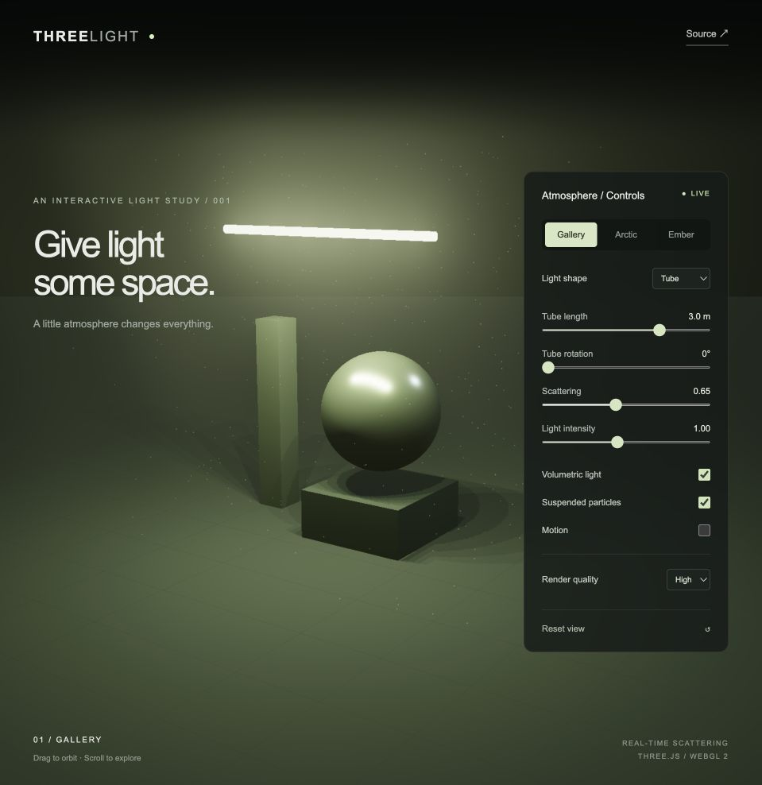

# ThreeLight

**Give light some space.** A small, interactive study of volumetric light, built with Three.js and original GLSL.

[Live playground](https://siyuhuh.github.io/threelight/) · [Report a bug](https://github.com/siyuhuh/threelight/issues)



## Explore

- Tube and spotlight emitters, with a visible light source. Tube length (0.5–4 m) and rotation (0–180°) change the source geometry and illumination together.
- Three atmosphere presets: Gallery, Arctic, and Ember.
- Live scattering, intensity, and beam spread controls.
- Toggle volumetric light and particles to compare the effect.
- Orbit and zoom around an entirely procedural scene.
- Low (24 samples) and high (56 samples) rendering modes.
- Motion toggle, reduced-motion preference support, and pause while the tab is hidden.
- WebGL initialization and context-loss feedback.

No account, backend, model downloads, external fonts, or API keys are required.

## Run locally

Use Node.js 22.12+ (Node.js 24 is recommended).

```sh
npm ci
npm run dev
```

Open the local URL printed by Vite. To build and preview the production bundle:

```sh
npm run build
npm run preview
```

## How it works

1. Three.js draws the procedural scene into a half-float color target with a depth texture. A spotlight or six shadow-casting point samples along a tube illuminate the surfaces. The tube is an omnidirectional line emitter; beam spread applies only to spotlight mode.
2. A fullscreen shader reconstructs a world-space view ray from the camera matrices and the scene depth.
3. The shader samples atmospheric scattering along that ray, stopping at the visible surface. Spotlight cone falloff or finite-line emitter sampling, distance attenuation, and a slowly varying density field shape the illumination.
4. Ray/sphere and ray/box intersections approximate visibility toward each emitter sample for the three scene objects. The floating sphere position is shared with the shader.
5. The accumulated light is composited with the scene. Shader-animated point sprites add suspended dust.

This is a visual approximation, not a physically accurate participating-media renderer. The volume occlusion is specific to the procedural objects: adding arbitrary meshes requires extending the occlusion representation. Particles are depth-tested against visible geometry but do not sample spotlight shadows. Tube lighting uses six midpoint samples shared between surfaces, atmosphere, and particle illumination. Total light power stays fixed as length changes. This finite sampling can produce stepped shadows and discrete highlights, especially for long tubes or nearby surfaces; it is not an exact continuous area-light solution. Tube radius is fixed, and position or arbitrary mesh-shaped emitters are not yet configurable. There is no temporal denoising or multiple scattering.

## Project structure

```text
src/main.js      Scene, interaction, controls, and rendering lifecycle
src/emitter.js   Shared finite-line sample layout and emitter shader helpers
src/volume.js    Original volumetric scattering and occlusion shaders
src/style.css    Responsive interface, using system fonts
```

## Deployment

The included GitHub Actions workflow builds on pull requests and pushes to `main`. Pushes to `main` deploy to GitHub Pages. In repository **Settings → Pages**, select **GitHub Actions** as the source. Relative asset URLs also allow deploying `dist/` to another static host.

## Compatibility and performance

A browser with WebGL 2 and renderable half-float textures is required. Mobile viewports default to low quality. High mode caps pixel ratio at 1.5; low mode caps it at 1. The effect still renders continuously while visible, including when animation is paused so camera and controls remain responsive. Actual frame rate depends on the GPU and viewport; physical-device mobile testing remains part of release validation.

## Inspiration and provenance

Inspired by the visual exploration in [cullenwebber/three-volumetric-light](https://github.com/cullenwebber/three-volumetric-light). This repository is a separately authored implementation, not a fork or a distribution of that project's code. It includes none of that project's shaders, models, fonts, or other assets. All displayed geometry is generated by this project.

Three.js and Vite are third-party dependencies distributed under their own licenses. The MIT license in this repository covers this project's original source.

## Contributing

See [CONTRIBUTING.md](CONTRIBUTING.md). Small, focused improvements and reproducible graphics bug reports are welcome.

## License

[MIT](LICENSE).
